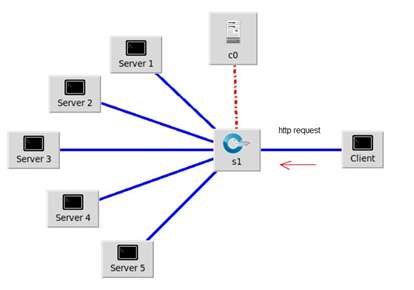
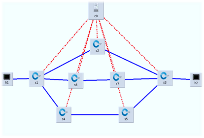
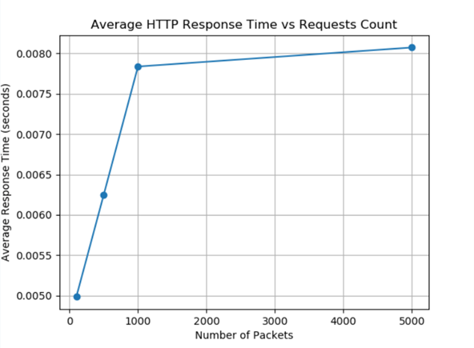
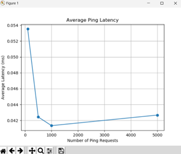

# ***Load Balancing in Software-Defined Networks (SDN)***
<p style="font-size: 15px;">This project explores load balancing in SDN environments using both server and path selection techniques. By implementing and comparing multiple algorithms, it aims to optimize network performance with respect to response time and throughput.</p>  

## ***Table of Contents***  
- [Project Overview](#project-overview)
- [Load Balancing Methods](#load-balancing-methods)
- [Performance Metrics](#performance-metrics)
- [Setup Instructions](#setup-instructions)
- [Results](#results)
## ***Project Overview***
<p style="font-size: 15px;">In SDN, decoupling the control and data planes enables dynamic management and configuration of network resources. This project utilizes both POX and Ryu controllers to demonstrate load balancing techniques that manage traffic across servers and paths, improving overall network performance.</p>

## ***Load Balancing Methods***
### ***1. Load Balancing on Server Selection***
<p style="font-size: 15px;">Using the POX controller, four algorithms were tested individually for server load balancing:</p>

- **Round-Robin:** Distributes requests sequentially to each server.
- **Weighted Round-Robin:** Prioritizes servers based on predefined weights.
- **Static Least Connection:** Chooses the server with the fewest active connections.
- **Random Selection:** Assigns incoming requests to a server at random.
<p style="font-size: 15px;">Each algorithm’s performance was tested by measuring:</p>

- **Average Response Time**
- **Throughput**

***Running Performance Measurement Scripts***
<p style="font-size: 15px;">The performance measurements were conducted using custom Python scripts, which will be included in the project. Follow these steps to set up the topology and execute the scripts.</p>

***Topology Setup for Server Selection***
<p style="font-size: 15px;">For server load balancing, a Mininet topology is created with:</p>

- **1 Open vSwitch (OVSwitch)**
- **6 Hosts:**
  - 1 Client: Generates traffic and measures performance metrics.
  - 5 Servers: Run HTTP servers to handle requests from the client.  
  

***Steps to Run Measurement Scripts***
1. **Set up the topology in Mininet**:
    - Launch Mininet and create the topology with the specified configuration.

   ```bash
   sudo mn --topo single,6 --mac --arp --controller=remote
   ```
    - Configure the hosts to run HTTP servers (for the 5 server hosts) and ensure the client host is set to initiate traffic.

    ```bash
   python3 -m http.server 80
   ```
1. **Execute the Python Measurement Scripts**:   
    - Navigate to the directory containing the measurement scripts(from the client).

    ```bash
   python3 <measurement_name>.py
   ```    
    - Replace `<measurement_name>` with the specific metric (e.g., `measureAveResponseTime`.py).

1. **Review Output**:
    - Each script outputs Average Response Time and Throughput metrics, logged for analysis.
### ***2. Load Balancing on Path Selection***
<p style="font-size: 15px;">Using the Ryu controller, two algorithms (DFS and Dijkstra) were applied for path load balancing, optimized by calculating the cost of paths based on:</p>

- **Bandwidth**
- **Latency**
<p style="font-size: 15px;">The optimal path was selected based on highest available bandwidth or lowest latency.</p>
<p style="font-size: 15px;">Each method’s performance was tested by measuring:</p>

- **Average Response Time**

***Running Performance Measurement Scripts***
<p style="font-size: 15px;">The performance measurements were conducted using custom Python scripts, which will be included in the project. Follow these steps to set up the topology and execute the scripts.</p>

***Topology Setup for Path Selection***
<p style="font-size: 15px;">For path load balancing, a Mininet topology is created with:</p>

- **7 Open vSwitch (OVSwitch)**
- **2 Clients**: Generates traffic and measures performance metrics.  
    

***Steps to Run Measurement Scripts***
1. **Set Up the Topology in Mininet and Execute the Python Measurement Script**:
    - Navigate to the directory containing the script (from the client).
    ```bash
   Python3 CreatingTopoWithAvrResponseTime.py
   ```  
1. **Review Output:**:
    - Each script outputs **Average Response Time** metric, logged for analysis.
## ***Performance Metrics***
<p style="font-size: 15px;">Key performance metrics used in evaluating the algorithms include:</p>

- **Average Response Time**: Measures the mean time taken for the server to respond to requests.
- **Throughput**: Indicates the amount of data successfully transmitted over the network in a given time frame.
## ***Setup Instructions***
### ***Prerequisites***
- Mininet for network emulation
- POX Controller for server load balancing
- Ryu Controller for path load balancing
### ***Installation***
1. **Clone the repository:**

    ```bash
    git clone <repository-url>
    cd <repository-directory>
   ```  
2. **Install Dependencies**:
   - Mininet: [Installation guide](https://github.com/mininet/mininet)
   - POX Controller: Download and configure from [here](https://github.com/noxrepo/pox)
   - Ryu Controller: Install using

     ```bash
     pip install ryu
     ```

3. **Running the Server Load Balancing Algorithms**
    - To start the POX controller with a specific algorithm, navigate to the POX directory and run (example of the command):
        ```bash
        ~/pox/pox.py log.level --DEBUG misc.weighted_round_robin --ip=10.0.1.1 --servers=10.0.0.1,10.0.0.2,10.0.0.3,10.0.0.4,10.0.0.5 --weights=5,4,3,2,1
        ```
        In the example above, `weighted_round_robin` is located in the directory `~/pox/pox/misc`.

4. **Running the Path Selection Algorithms**

    - Launch the Ryu controller:
        ```bash
        ryu-manager <path-selection-method>.py
        ```
    - Replace `<path-selection-method>` with the specific method (e.g., `multipathWithLatencyCost`.py).
    - Test by sending packets through the Mininet topology and monitor path selection.
## Results
<p style="font-size: 15px;">Below are summaries of the performance metrics for each algorithm:</p>

- **Server Selection Algorithms**:  


- **Path Selection Algorithms**:  
  


